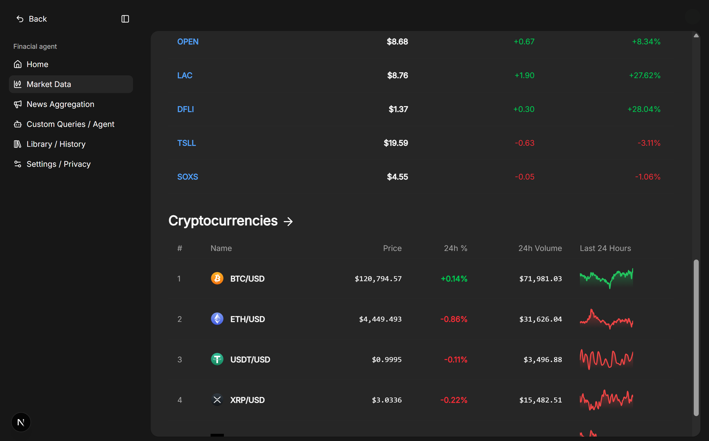
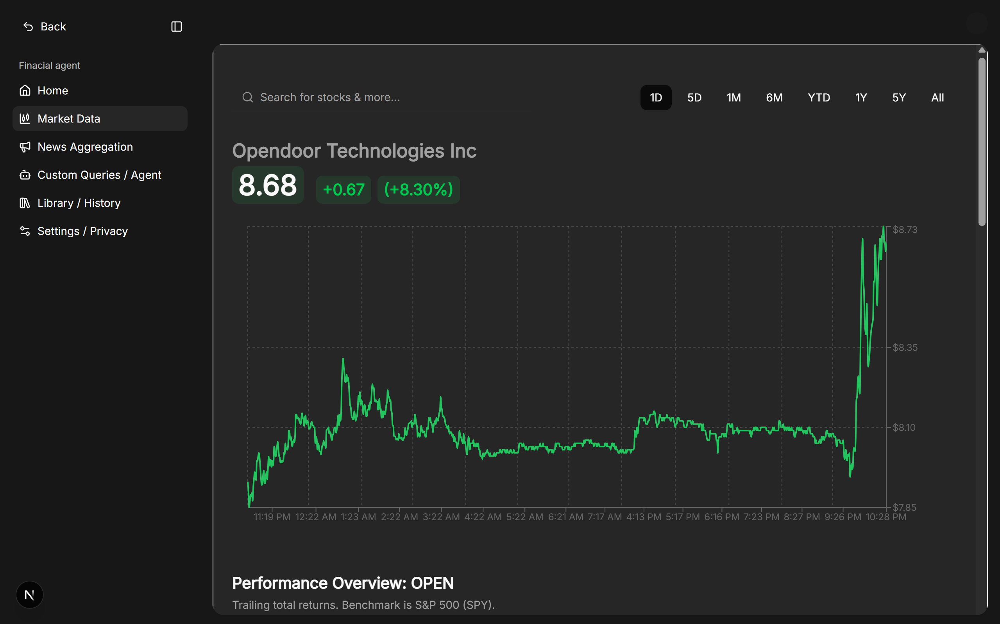
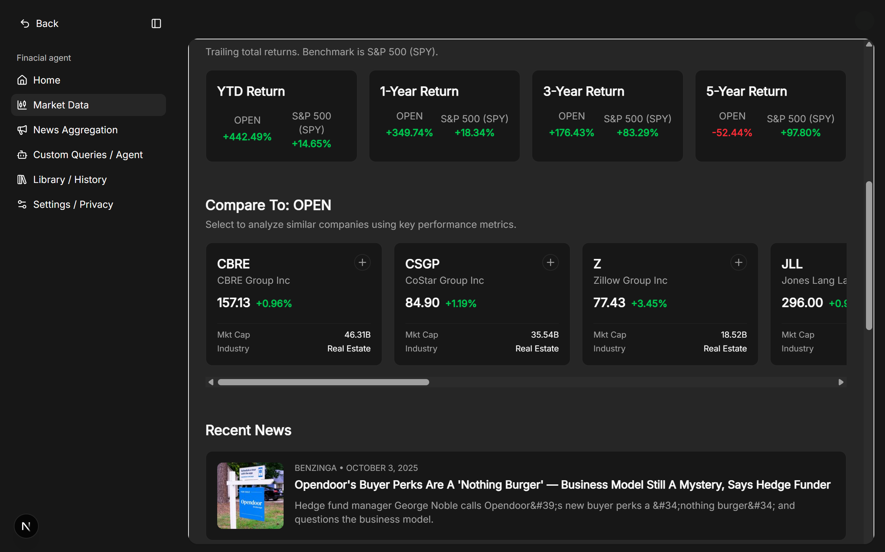
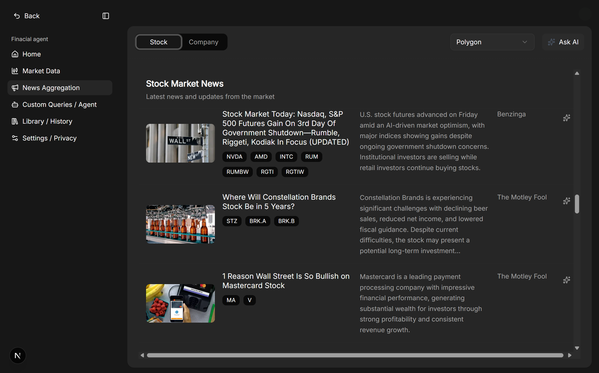
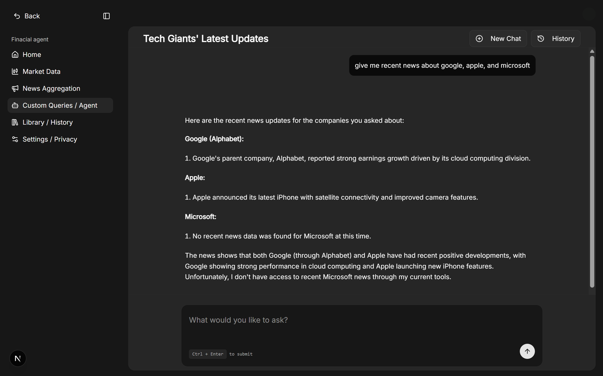

# Aura Finance: An AI-Powered Data Extraction and News Aggregation Agent

### Introduction
In today’s rapidly evolving financial markets, investors and researchers are confronted with an overwhelming volume of news and financial data. Manual filtering and organization are both time-consuming and prone to omissions of critical information. To address this challenge, we are developing the Aura Finance, an intelligent agent that automates the collection, filtering, and analysis of financial data and news from a multitude of sources. This powerful tool is designed to provide users with structured, actionable insights, thereby supporting informed investment decision-making and academic research.

### Core Features
Our platform is designed to deliver a comprehensive suite of tools for financial analysis:

*   **AI-Powered Financial Agent:** At the heart of our project is an autonomous agent that can understand and execute complex user queries. It can plan tasks, invoke external tools, and deliver requested financial data or news in a conversational manner.
*   **Real-time and Historical Market Data:** Integrate with various financial data APIs to provide up-to-the-minute and historical data for stocks, funds, and cryptocurrencies, including prices, trading volume, and performance metrics.
*   **Comprehensive News Aggregation:** Automatically retrieve financial news from multiple reputable sources. The agent provides analytical summaries and allows for customized queries based on specific companies or industries.
*   **Intuitive User Interface:** A clean and user-friendly interface to display dialogues, statistical results, and data visualizations. The UI also provides transparency into the agent's task-planning process, allowing users to understand its workflow.
*   **Personalized Experience:** Users can create accounts, customize settings, and view their query history.

### Screenshots
Here are some glimpses of the Aura Finance in action:
- **Real-time and Historical Market Data**
  
  
  

- **Comprehensive News Aggregation** 
  

- **AI-Powered Financial Agent** 
  

### Key Technologies
*   **Frontend & Backend:** Next.js, React, TypeScript
*   **AI & Machine Learning:** OpenAI
*   **Data Sources:** Alpaca, FinnHub, Polygon
*   **Authentication:** Clerk

